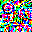
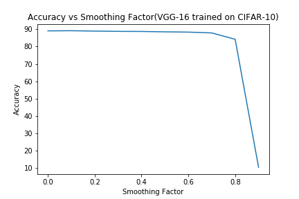
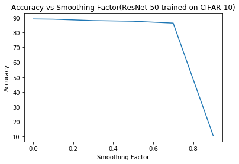

# Label Smoothing and Adversarial Robustness

---

### Author
Arpit Aggarwal

### Introduction to the Project 
This project surveys the various adversarial attacks on neural networks. This is useful in cases where we deploy the deep learning systems in real-world scenarios like autonomous driving. First, different CNN architectures(VGG-16, VGG-19 and ResNet-50) are trained on CIFAR-10 dataset. Then after training these architectures, various adversarial examples from CIFAR-10 dataset are generated and consequently these examples are used to evaluate how robust these pretrained models are to various forms of adversarial attacks. Different adversarial attacks like FGSM, I-FGSM and DeepFool were implemented and their consequent adversarial example was reported where the pretrained model mis-classified the input.

### Data
The data used for this task was CIFAR-10 dataset. The dataset has been divided into two sets: Training data and Validation data. The analysis of different CNN architectures for image classifcation on CIFAR-10 dataset was done on comparing the Training Accuracy and Validation Accuracy values.

### FGSM Attack
FGSM is a non-targeted white box attack. The aim of the attack is to ensure the input image is perturbed with noise which makes it to mis-classify the input other than the actual target class. This is done by adding the gradient of the loss function(predicted output and actual class) wrt to the input image to the input image so that it leads to classifying the input to a class other than the actual target class. An example is shown below:  

### I-FGSM Attack
I-FGSM is a targeted white box attack. The aim of the attack is to add noise in the input image so that it can classify the input image to a specific targeted class. This is done by adding the gradient of loss function(predicted output and targeted class rather than the actual class) wrt to the input image to the input image so that it leads to classifying the input to a specific targeted class. An example is shown below:  

### Results

#### Accuracy vs Smoothing Factor(VGG-16 trained on CIFAR-10)

#### Accuracy vs Smoothing Factor(ResNet-50 trained on CIFAR-10)

#### Training-Evaluation Results
The results after using different CNN architectures on CIFAR-10 dataset are given below:

1. <b>ResNet-50(pretrained on ImageNet dataset)</b> 

Training Accuracy = 97.31% and Validation Accuracy = 82.63% (e = 100, lr = 0.001, m = 0.9, bs = 64, wd = 5e-4) 

2. <b>VGG-16(pretrained on ImageNet dataset, smoothing factor=0.0, epochs=250, lr=0.001, wd=5e-4)</b> 

Validation Accuracy = 89.01% 

3. <b>VGG-16(pretrained on ImageNet dataset, smoothing factor=0.1, epochs=250, lr=0.001, wd=5e-4)</b> 

Validation Accuracy = 89.10% 

4. <b>VGG-16(pretrained on ImageNet dataset, smoothing factor=0.2, epochs=250, lr=0.001, wd=5e-4)</b> 

Validation Accuracy = 88.88% 

5. <b>VGG-16(pretrained on ImageNet dataset, smoothing factor=0.3, epochs=250, lr=0.001, wd=5e-4)</b> 

Validation Accuracy = 88.74% 

6. <b>VGG-16(pretrained on ImageNet dataset, smoothing factor=0.4, epochs=250, lr=0.001, wd=5e-4)</b> 

Validation Accuracy = 88.67% 

7. <b>VGG-16(pretrained on ImageNet dataset, smoothing factor=0.5, epochs=250, lr=0.001, wd=5e-4)</b> 

Validation Accuracy = 88.45% 

8. <b>VGG-16(pretrained on ImageNet dataset, smoothing factor=0.6, epochs=250, lr=0.001, wd=5e-4)</b> 

Validation Accuracy = 88.30% 

9. <b>VGG-16(pretrained on ImageNet dataset, smoothing factor=0.7, epochs=250, lr=0.001, wd=5e-4)</b> 

Validation Accuracy = 87.83% 

10. <b>VGG-16(pretrained on ImageNet dataset, smoothing factor=0.8, epochs=250, lr=0.001, wd=5e-4)</b> 

Validation Accuracy = 84.17% 

11. <b>VGG-16(pretrained on ImageNet dataset, smoothing factor=0.9, epochs=250, lr=0.001, wd=5e-4)</b> 

Validation Accuracy = 10.54% 

### Software Required
To run the jupyter notebooks, use Python 3. Standard libraries like Numpy and PyTorch are used.

### Credits
The following links were helpful for this project:
1. https://pytorch.org/tutorials/beginner/fgsm_tutorial.html
2. https://www.youtube.com/channel/UC88RC_4egFjV9jfjBHwDuvg
3. https://github.com/pytorch/tutorials
